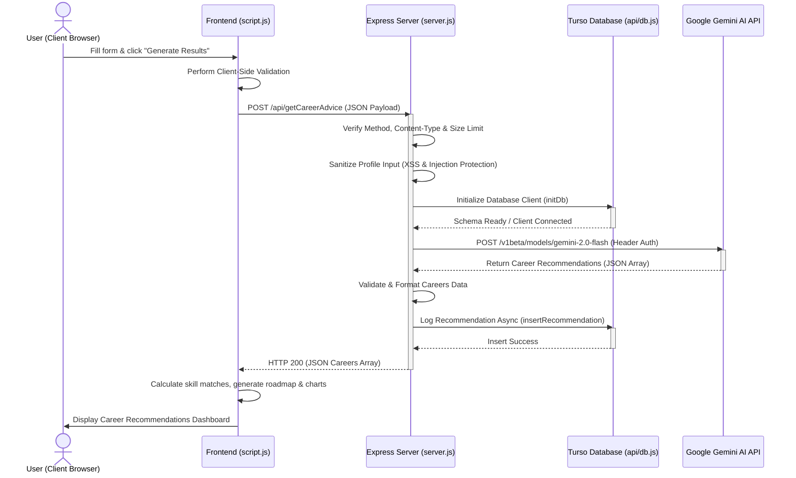

# CareerPath AI

**CareerPath AI** is an intelligent career guidance platform that uses Google's Gemini AI to provide personalized career recommendations based on your skills, interests, and goals, persisting recommendations securely in a Turso cloud database

---

## Architecture

CareerPath AI uses a modern, decoupled architecture designed to be light, secure, and easily deployable as a full Node.js app (on Render) or serverless functions (on Vercel).

```
┌────────────────────────────────────────────────────────┐
│                      Client Browser                    │
│   (index.html, script.js, Tailwind CSS, Chart.js)      │
└──────────────────────────┬─────────────────────────────┘
                           │ HTTP POST /api/getCareerAdvice
                           ▼
┌────────────────────────────────────────────────────────┐
│                   Express Server (server.js)           │
│   - Serves static assets                               │
│   - Wraps serverless functions for Node.js runtimes    │
└──────────────────────────┬─────────────────────────────┘
                           │ Imports / Executes
                           ▼
┌────────────────────────────────────────────────────────┐
│             Serverless Handler (getCareerAdvice.js)    │
│   - Content-Type, HTTP method & request size checks   │
│   - Input sanitization & security response headers     │
└──────────────┬──────────────────────────┬──────────────┘
               │                          │
               │ HTTP API Request         │ libSQL Protocol
               ▼                          ▼
┌──────────────────────────┐    ┌────────────────────────┐
│  Google Gemini AI API    │    │      Turso Database     │
│   (gemini-2.0-flash)     │    │       (api/db.js)      │
└──────────────────────────┘    └────────────────────────┘
```

- **Frontend (Presentation Layer)**: A clean, responsive dashboard designed with Tailwind CSS, supporting dark/light mode toggle, dynamic skill gap charts (Chart.js), PDF report generation (jsPDF), and multi-step form capture.
- **Server Wrapper (Router/Hosting Layer)**: An Express.js instance serving static files and routing API traffic, rendering the app compatible with long-running Node platforms.
- **API Handler (Controller/Validation Layer)**: A secure backend handler executing content verification, sanitizing payloads, requesting JSON-mode outputs from AI, and managing fallback operations.
- **Database (Persistence Layer)**: A cloud SQLite database powered by Turso, storing user profiles and recommendations asynchronously using the `@libsql/client` wrapper.

---

## System Workflow

The diagram below outlines the sequential lifecycle of a career recommendation query:



---

## Detailed Working (How it Works)

1. **Information Capture**: The user enters their profile (name, email, skills, experience, status, interests, goals, constraints, target salary) inside a 4-step wizard.
2. **Client-Side Verification**: Before transmitting, the client ensures mandatory fields are populated, validates the email format, and checks that the user has selected at least one interest.
3. **Security Screening**: The server checks that the payload is less than 20KB, strips any HTML/XML tags to prevent Cross-Site Scripting (XSS), filters control characters to prevent prompt injections, and validates that mandatory variables are present.
4. **AI Generation (Structured Response)**:
   - The backend constructs a structured prompt merging the user profile with specific formatting rules.
   - It sends the request to the latest `gemini-2.0-flash` model.
   - Using the `responseMimeType: "application/json"` parameter, the AI is forced to return a clean, structured JSON array of career objects containing: `"career"`, `"match"`, `"description"`, `"requiredSkills"`, `"missingSkills"`, `"salary"`, `"demand"`, `"growth"`, and `"trend"`.
5. **Database Persistence**: Once recommendations are fetched and validated on the backend, the user's profile and results are logged asynchronously into the `career_recommendations` table on Turso, providing a persistent request history.
6. **Graceful Fallback Mode**: If the Google Gemini API or Turso Database throws an error (e.g. rate limits or connection dropouts), the backend catches the error, falls back to a local rule-based expert matching algorithm, logs the event, and returns a valid set of career paths, ensuring the app remains online and usable.
7. **Dashboard Rendering**: The client receives the career array, calculates exact skill match weights, dynamically plots skill gap progress bars using Chart.js, generates a 12-week weekly learning roadmap, and renders options to export the report as a PDF.

---

## Features

- 🤖 **AI-Powered Recommendations** — Get career suggestions powered by Google Gemini AI.
- 💾 **Data Persistence** — Logs recommendations and profiles securely in a Turso cloud database.
- 🎯 **Personalized Matching** — 3 tailored career paths with match percentages.
- 📊 **Skill Gap Analysis** — Identify missing skills and get learning recommendations.
- 📅 **Learning Roadmap** — 12-week structured plan with curated resources.
- 🌙 **Dark Mode** — Comfortable viewing in any lighting condition.
- 📱 **Responsive Design** — Works on desktop, tablet, and mobile.
- 📤 **Export & Share** — Export results as PDF or share with others.
- 🛡️ **Enterprise Security** — Built-in security headers, input sanitization, API key protection, and request constraints.

---

## Technologies Used

- **Frontend:** HTML5, CSS3, JavaScript (ES6+), Tailwind CSS, Chart.js, Font Awesome, jsPDF
- **Backend:** Express.js, Node.js (with Vercel Serverless compatibility)
- **Database:** Turso (libSQL Cloud Database)
- **AI:** Google Gemini (Generative Language API)

---

## Environment Variables

Create a `.env` file in the project root and add the following keys:

```text
# Gemini API key from Google AI Studio
GEMINI_API_KEY=your_gemini_api_key_here

# Turso Cloud Database Credentials
TURSO_DATABASE_URL=libsql://your-database-name.turso.io
TURSO_AUTH_TOKEN=your_auth_jwt_token_here
```

---

## Local Development

1. **Clone the repository**

   ```bash
   git clone <your-repo-url>
   cd careerpath-ai
   ```

2. **Install dependencies**

   ```bash
   npm install
   ```

3. **Configure environment variables**
   - Copy `.env.example` to `.env`.
   - Update the values with your Gemini API key and Turso Database credentials.

4. **Run the local server**

   ```bash
   npm run dev
   ```

   Visit `http://localhost:3000` to test the application locally.

---

## Deployment Guides

### 1. Deploying to Render (Recommended)
1. Commit and push the repository to GitHub.
2. Go to [Render Dashboard](https://dashboard.render.com/) and create a **New Web Service**.
3. Link your **CAREERPATH-AI** repository.
4. Set the following parameters:
   - **Runtime**: `Node`
   - **Build Command**: `npm install`
   - **Start Command**: `npm start`
5. Click **Advanced** and add your `GEMINI_API_KEY`, `TURSO_DATABASE_URL`, and `TURSO_AUTH_TOKEN` environment variables.
6. Click **Create Web Service**.

### 2. Deploying to Vercel
Since the api handlers are situated inside the `api` folder, the codebase is fully compatible with Vercel serverless functions:
1. Connect your repository to **Vercel** (https://vercel.com).
2. Add the environment variables (`GEMINI_API_KEY`, `TURSO_DATABASE_URL`, `TURSO_AUTH_TOKEN`) in the project settings.
3. Deploy. Vercel will build the frontend assets statically and run the handlers as serverless functions.

---

## License

This project is licensed under the MIT License. See the `LICENSE` file for details.
